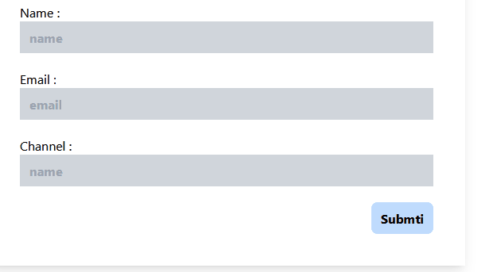

## Formik React project Install

### Step:

setup react command line:

    npx create-react-app project-name

setup react command line:

    npm install formik --save

Tailwind css install for React vite project

    npm install -D tailwindcss postcss autoprefixer
    npx tailwindcss init -p

> #### Simple Html Form Desgin

FromFormik.js

```javascript
import React from "react";

function FormikForm() {
  return (
    <div className="w-[600px]   mx-auto    shadow-lg p-10">
      <div>
        <form className="flex flex-col gap-5">
          <div>
            <label htmlFor="">Name : </label>
            <input
              className="w-full px-3 py-2  font-bold  bg-gray-300"
              name="name"
              type="text"
              placeholder="name"
            />
          </div>
          <div>
            <label htmlFor="">Email : </label>
            <input
              className="w-full px-3 py-2  font-bold  bg-gray-300"
              name="name"
              type="text"
              placeholder="name"
            />
          </div>
          <div>
            <label htmlFor="">Channel : </label>
            <input
              className="w-full px-3 py-2  font-bold  bg-gray-300"
              name="name"
              type="text"
              placeholder="name"
            />
          </div>
          <div className="text-right">
            <button
              type="submit"
              className="bg-blue-200  rounded-lg px-3 py-2 font-bold"
            >
              Submti
            </button>
          </div>
        </form>
      </div>
    </div>
  );
}
export default FormikForm;
```

## UseFormik Setup and Work

Step :

- import useFormik
- variable Declaire useFormik as formik
  - initial values declaire
  - onsubmit function declaire
  - validate functionality
- input form show values , onchange and onblur
- form tag called onSubmit


FormFormik.js

```javascript
import React from "react";

// first import useFormik
import { useFormik } from "formik";

function FormikForm() {
  // second declaire formik
  const formik = useFormik({
    // initial value
    initialValues: {
      name: "",
      email: "",
      channel: "",
    },

    // onsubmit value  reuturn
    onSubmit: (values) => {
      console.log(values);
    },

    // validate form condition declaire
    validate: (values) => {
      let errors = {};

      // name validate input
      if (!values.name) {
        errors.name = "Required Name ";
      }

      // email validate input
      if (!values.email) {
        errors.email = "Required Name ";
      } else if (
        !/^[A-Z0-9._%+-]+@[A-Z0-9.-]+\.[A-Z]{2,4}$/i.test(values.email)
      ) {
        errors.email = "Invalid email format";
      }

      // channel   input validate
      if (!values.channel) {
        errors.channel = "Required Channel ";
      }

      return errors;
    },
  });

  console.log(formik.values);
  console.log(formik.errors);
  return (
    <div className="w-[600px]   mx-auto    shadow-lg p-10">
      <div>
        <form className="flex flex-col gap-5" onSubmit={formik.handleSubmit}>
          <div>
            <label htmlFor="">Name : </label>
            <input
              className="w-full px-3 py-2  font-bold  bg-gray-300"
              name="name"
              type="text"
              placeholder="name"
              onChange={formik.handleChange}
              value={formik.values.name}
            />
          </div>
          <div>
            <label htmlFor="">Email : </label>
            <input
              className="w-full px-3 py-2  font-bold  bg-gray-300"
              name="email"
              type="text"
              placeholder="email"
              onChange={formik.handleChange}
              value={formik.values.email}
            />
          </div>
          <div>
            <label htmlFor="">Channel : </label>
            <input
              className="w-full px-3 py-2  font-bold  bg-gray-300"
              name="channel"
              type="text"
              placeholder="name"
              onChange={formik.handleChange}
              value={formik.values.channel}
            />
          </div>
          <div className="text-right">
            <button
              type="submit"
              className="bg-blue-200  rounded-lg px-3 py-2 font-bold"
            >
              Submti
            </button>
          </div>
        </form>
      </div>
    </div>
  );
}

export default FormikForm;
```

> Error show

```javascript
{
  formik.errors.channel && (
    <span className="text-red-900  font-bold">{formik.errors.channel}</span>
  );
}
```

#### Error Show just Touched Component

code :

```javascript
<input
  name="email"
  type="text"
  onChange={formik.handleChange}
  onBlur={formik.handleBlur} // add new event for  touched error show
  value={formik.values.email}
/>;

// show mesage component
{
  formik.errors.email && formik.touched.email && (
    <span className="text-red-900  font-bold">{formik.errors.email}</span>
  );
}
```



#### Seperate formik values

```javascript
// intitial values declaire
const initialValues = {
  name: "",
  email: "",
  channel: "",
};

// validation form
const validate = (values) => {
  let errors = {};

  // name validate input
  if (!values.name) {
    errors.name = "Required Name ";
  }

  // email validate input
  if (!values.email) {
    errors.email = "Required Name ";
  } else if (!/^[A-Z0-9._%+-]+@[A-Z0-9.-]+\.[A-Z]{2,4}$/i.test(values.email)) {
    errors.email = "Invalid email format";
  }

  // channel   input validate
  if (!values.channel) {
    errors.channel = "Required Channel ";
  }

  return errors;
};

// onsubmit
const onSubmit = (values) => {
  console.log(values);
};

// second declaire formik
const formik = useFormik({
  // initial value
  initialValues,

  // onsubmit value  reuturn
  onSubmit,

  // validate form condition declaire
  validate,
});
```


### Schema validation with Yup
    npm i yup

> validation scheema  of yup 

```javascript 
  // validation scheema of yup 
  const validationSchema = Yup.object({
    name:Yup.string().required("Name field is required "),
    email:Yup.string().required("email required").email("invalid email"),
    channel:Yup.string().required("Channek  field is required "),
  })
```